## 人工智能学习路线

这个代码仓的内容是我公众号上的文章[《如果真的学习人工智能》](https://mp.weixin.qq.com/s?__biz=MzU4NTIxODYwMQ==&mid=2247485792&idx=1&sn=d60b5c9b1a505b96abb283a95871a9ae&chksm=fd8ca626cafb2f30494c235cb84ef7b2d251f6fc590457790135cd460fb43a574042d5b167dd&token=350451291&lang=zh_CN#rd)的整理，我将在这里提供一个人工智能专业的学习路径。

为了让内容整体更有体系，我将所有的内容分成四个阶段。每个阶段可以简单理解成对应大学的一个学年。也就是如果大家假想自己现在高中毕业的话，根据这篇文章提供的“学习地图”，使用四年的时间，就可以在人工智能的深度和广度上都有相当地理解和掌握了。

对，你没有看错，是四年的时间。相当于读一个本科的时间。

所以，这不是一份广告。因为所有培训广告只会告诉你四个月就够；但所有人都明白四个月是不够的。如果四个月就可以掌握人工智能，人工智能也太简单了，它也就不值钱了。

对于这份学习路径，大家也可以划分为两部分。前两年是第一部分；后两年是第二部分。

对于计算机科班的同学来说，可以直接学习后两年的内容，切入人工智能领域；

而如果把前两年的内容切实学扎实了，再辅以其他专业课学习，基本可以轻松转向计算机科学的任何方向。

当然，由于每个人基础不同，所以对于这份比较全面的学习路径，有些同学可能已经掌握了相当的内容，那么就可以跳过一些内容，加快速度了。

这份学习路径中的大部分资料，都使用开源的资源，或者是比较著名的图书推荐。

如果大家有其他好的资源推荐，欢迎随时提 issue：）

 

---

**相关推荐：**

我的另一个代码仓，包含大量开源资源分享： [是不是很酷开源分享](https://github.com/liuyubobobo/cool-open-sharings)

我的公众号是【是不是很酷】。

---

### 简略版

#### 第一年：语言基础 + 数学

| | | |
| --- | --- | --- |
| Python 语言 | Python Crash Course, 2nd Edition [Amazon](https://www.amazon.com/Python-Crash-Course-2nd-Edition/dp/1593279280/ref=sr_1_1?crid=2UQKDUERI787R&dchild=1&keywords=python+crash+course&qid=1592815039&sprefix=python+crash%2Caps%2C201&sr=8-1)   [京东](https://union-click.jd.com/jdc?e=jdext-1258438628390801408-0&p=AyIGZRhbHQsWAVIaXxEyEgddE1kVABc3EUQDS10iXhBeGlcJDBkNXg9JHUlSSkkFSRwSB10TWRUAFxgMXgdIMhJBHGAAV1JwZQkBLUZ9agQwcwlidWILWStbHAIQD1QaWxIBIgdUGlsRBxEEUxprJQIXNwd1g6O0yqLkB4%2B%2FjcePwitaJQIWD1YSWxECFw9THVglAhoDZc31gdeauIyr%2FsOovNLYq46cqca50ytrJQEiXABPElAeEgRREl4XCxUEXBlTFAsTB1AaUgkDIgdUGlsdBRUPUBI1FGwRBlcaUxwFFwZdK1slASJZOxoLRgYTAgEcNU9RUg9UQAtBbBAPVhhTEQYQN1caWhcA) | 书籍 |
| | Automate the Boring Stuff with Python, 2nd Edition [Amazon](https://www.amazon.com/Automate-Boring-Stuff-Python-2nd/dp/1593279922/ref=sr_1_1?crid=3T93PNJC9WLSH&dchild=1&keywords=automate+the+boring+stuff+with+python&qid=1592894089&sprefix=automate%2Caps%2C208&sr=8-1)  [第二版英文原版内容线上版本](https://automatetheboringstuff.com/2e/) [京东](https://union-click.jd.com/jdc?e=jdext-1258439152880070656-0&p=AyIGZRhbHQsWAVIaXxEyEgddHlkcBhA3EUQDS10iXhBeGlcJDBkNXg9JHUlSSkkFSRwSB10eWRwGEBgMXgdIMnZCXFwmEARZZD1TPxZaZX8tUyFgWmILWStbHAIQD1QaWxIBIgdUGlsRBxEEUxprJQIXNwd1g6O0yqLkB4%2B%2FjcePwitaJQIWD1YSWxEBFAJcHV0lAhoDZc31gdeauIyr%2FsOovNLYq46cqca50ytrJQEiXABPElAeEgRREl4XChIDVhJSFAMUBlIfXAkDIgdUGlsdBRUPUBI1FGwRBlcaUxwFFwZdK1slASJZOxoIFlFGAwBPNU9RUg9XHR8TbBcHVBpYFAYQN1caWhcA) | 书籍 |
| | Introducing Python [Amazon](https://www.amazon.com/Introducing-Python-Modern-Computing-Packages/dp/1492051365/ref=sr_1_1?dchild=1&keywords=Introducing+Python&qid=1593034272&sr=8-1) [京东](https://union-click.jd.com/jdc?e=jdext-1259372381283463168-0&p=AyIGZRhbHQsWAVIaXxEyEgdcGFsXBRc3EUQDS10iXhBeGlcJDBkNXg9JHUlSSkkFSRwSB1wYWxcFFxgMXgdIMlkdNRssb1YXZAccHGNCb2VcAQxyGGILWStbHAIQD1QaWxIBIgdUGlsRBxEEUxprJQIXNwd1g6O0yqLkB4%2B%2FjcePwitaJQIWD1caWRMEFAVTH10lAhoDZc31gdeauIyr%2FsOovNLYq46cqca50ytrJQEiXABPElAeEgRRE1kTARAOVRhSFwcVBVUcUgkDIgdUGlsdBRUPUBI1FGwRBlcaUxwFFwZdK1slASJZOxoIFQpGDwAfNU9RV04PH1tWbBcPVRJSFwYXN1caWhcA) | 书籍 |
| | Fluent Python [Amazon](https://www.amazon.com/Fluent-Python-Concise-Effective-Programming/dp/1491946008/ref=sr_1_1?dchild=1&keywords=Fluent+Python&qid=1593034574&sr=8-1) [京东](https://union-click.jd.com/jdc?e=jdext-1259372593155031040-0&p=AyIGZRhbHQsWAVIaXxEyEgRVElwVChE3EUQDS10iXhBeGlcJDBkNXg9JHUlSSkkFSRwSBFUSXBUKERgMXgdIMkBeEwEvYV5VYhRDHhF8VVhURlJgAFQLWStbHAIQD1QaWxIBIgdUGlsRBxEEUxprJQIXNwd1g6O0yqLkB4%2B%2FjcePwitaJQIWD1caWRMLEQJQHVslAhoDZc31gdeauIyr%2FsOovNLYq46cqca50ytrJQEiXABPElAeEgRRE1kTARYPVxtfEQMQB1QeWgkDIgdUGlsdBRUPUBI1FGwRBlcaUxwFFwZdK1slASJZOxoLRlUaVV0eNU9RV04IEl1CbBcBUBxYFAoaN1caWhcA) | 书籍 |
| C++ | C++ Primer [Amazon](https://www.amazon.com/Primer-5th-Stanley-B-Lippman/dp/0321714113/ref=sr_1_1?dchild=1&keywords=C%2B%2B+Primer&qid=1592895269&sr=8-1) [京东](https://union-click.jd.com/jdc?e=jdext-1258440104961826816-0&p=AyIGZRhbHQsWAVIaXxEyEgdXGlwVABs3EUQDS10iXhBeGlcJDBkNXg9JHUlSSkkFSRwSB1caXBUAGxgMXgdIMkpVA0ZfbwFJZSdtEFN4anMxGS4LRlQLWStbHAIQD1QaWxIBIgdUGlsRBxEEUxprJQIXNwd1g6O0yqLkB4%2B%2FjcePwitaJQIWD1YSWxEGEwdcG1IlAhoDZc31gdeauIyr%2FsOovNLYq46cqca50ytrJQEiXABPElAeEgRREl4QAxIGUBNcFQsRAFwbXAkDIgdUGlsdBRUPUBI1FGwRBlcaUxwFFwZdK1slASJZOxoIFgtHUlceNU9RUg9cGBMWbBcGXR9TFAcTN1caWhcA) | 书籍 |
| | C++ Crash Course [Amazon](https://www.amazon.com/C-Crash-Course-Josh-Lospinoso/dp/1593278888/ref=sr_1_1?dchild=1&keywords=C%2B%2B+Crash+Course&qid=1593034061&sr=8-1) | 书籍 |
| 程序运行底层 & C | [CS107：Computer Organization & Systems](https://web.stanford.edu/class/archive/cs/cs107/cs107.1206/index.html) | 斯坦福公开课 |
| 微积分 | 托马斯微积分 [京东](https://union-click.jd.com/jdc?e=jdext-1258440798091669504-0&p=AyIGZRNeFwsaAlMZWyUCEw5SHV0WCxcHZV8ETVxNNwxeHlRAGRlLQx5BXg1cAAQJS14MB1QSXBMEEQ5QG0RMR05aZR8Pc0dtbA1TOF5kew4iZB1qfGBCImtXGTISDlUZUxQDEgBWK1sUAxIDUBhYEwMiN1Uea1RsFwBXGlMlAyIHURNYHAIWAFIdWhwEIgddH2vDrIbS3aSCpafErfvO1qXXm6yBpd0lMiIEZUAOQUtXG1UYXxwHFwZTE1IUChIAUhNfFAcOBmUbWhQCGgBSE14cbBNpVhpZFAobAFAaUyUCIgRlRTUUUkEDVB4PHGxIVBUTCElUWWlXE1gSBBcCUStZFAMQBQ%3D%3D) | 书籍 |
| | 普林斯顿微积分读本 [京东](https://union-click.jd.com/jdc?e=jdext-1258441302003757056-0&p=AyIGZRprFQETA1IeWhYyVlgNRQQlW1dCFFlQCxxKQgFHRE5XDVULR0UVARMDUh5aFh1LQglGa08GQQ8TcloXYWlbB2gsVXdXUjBfHXUOHjdVElsXChMGVRxYJQITBlUfXhYBFAZlK1sQMkRpVRpaFAMTAlEcXCUDIgdRE1gcAhYBXB1YEwYiB10fa8OshtLdpIKlp8St%2B87WpdebrIGl3SUyIgRlQA5BS1cbVRhfHAcXB1caWBQDEAFRHVoRBQ4GZRtaFAIaAFITXhxsE2lWGlkUChsAUBpTJQIiBGVFNRRSQVBdSVMVbEhUFRMPEwQaaVcTWBIBEwFTK1kUAxAF) | 书籍 | 
| 线性代数 | Introduction to Linear Algebra [Amazon](https://www.amazon.com/Introduction-Linear-Algebra-5Th-Edn/dp/B074PY55RL/ref=sr_1_6?crid=RTU9EFRMIMQ0&dchild=1&keywords=introduction+to+linear+algebra&qid=1592895558&sprefix=introduction+to+linear%2Caps%2C206&sr=8-6) [京东](https://union-click.jd.com/jdc?e=jdext-1258442060950409216-0&p=AyIGZRprFQEVD10bXhYyVlgNRQQlW1dCFFlQCxxKQgFHRE5XDVULR0UVARUPXRteFh1LQglGa2sFSF1SaQFMYWdDKUcedltCATRmXVMOHjdVElsXChMGVRxYJQITBlUfXhYBFAZlK1sQMkRpVRpaFAMTAlUbWyUDIgdRE1gcAhYPUhJYFgEiB10fa8OshtLdpIKlp8St%2B87WpdebrIGl3SUyIgRlQA5BS1cbVRhfHAcXBFQcWh0GEwJUE1gVBQ4GZRtaFAIaAFITXhxsE2lWGlkUChsAUBpTJQIiBGVFNRRSQQNUHg8SbEhUFRMDFkdPaVcTWBIDEAZWK1kUAxAF) | 书籍 |
| | [Linear Algebra](https://ocw.mit.edu/courses/mathematics/18-06-linear-algebra-spring-2010/index.htm)   [A 2020 Vision of Linear Algebra](https://ocw.mit.edu/resources/res-18-010-a-2020-vision-of-linear-algebra-spring-2020/videos/) | MIT 公开课 |
| | Linear Algebra and Its Applications [Amazon](https://www.amazon.com/Linear-Algebra-Its-Applications-5th/dp/032198238X/ref=sr_1_1?dchild=1&keywords=Linear+Algebra+and+Its+Applications&qid=1592895867&sr=8-1) [京东](https://union-click.jd.com/jdc?e=jdext-1258442438882521088-0&p=AyIGZRtSEQoUBFUbXRIyEABXHV4TBBQFUBtrUV1KWQorAlBHU0VeBUVNR0ZbSkAOClBMW0sZXBcEFwFTHVkQAg1eEEcGJXhIHS5ACXAEck8JGDhiHBNXEFg6T2IeC2UbUhUAGgZUG1wWMhIGVBtfEAERAVQraxUHIkY7HlsUCxA3VCtbEQoRDlUcWhELFwZQK1sdBiLR%2B4%2BOnb3Lt%2FDN8bvXn7eAkvDBvJQ3ZStYJVlHUxxeRxUBFg5QHlgQABsOXBhfFgITDlwHWiUCEwZVE1wSChcOOxo1FgMQBl0SXBADGjdVK1glXHwGBhgIRwVBDjtBCFUKSAYBWTUQAxoOXBJaEDIQBlQZWQ%3D%3D) | 书籍 |
| | Linear Algebra Done Right [Springer官网](https://link.springer.com/book/10.1007/978-3-319-11080-6) [PDF下载](downloads/2015_Book_LinearAlgebraDoneRight.pdf) | 书籍 |
| 概率论 | [CS109: Probability for Computer Scientists](http://web.stanford.edu/class/cs109/) | 斯坦福公开课 |

 

#### 第二年：计算机基础

| | | |
| --- | --- | --- |
| 算法与数据结构 | 算法4 [Amazon](https://www.amazon.com/Algorithms-4th-Robert-Sedgewick/dp/032157351X/ref=sr_1_1?dchild=1&keywords=algorithm&qid=1592939552&sr=8-1) [京东](https://union-click.jd.com/jdc?e=jdext-1258443669071400960-0&p=AyIGZRhbHQsWAVIaXxEyEgdUE1ITCxo3EUQDS10iXhBeGlcJDBkNXg9JHUlSSkkFSRwSB1QTUhMLGhgMXgdIMkxTBUEtfHlvZDYYB1ZYTV1RRSN3Y0QLWStbHAIQD1QaWxIBIgdUGlsRBxEEUxprJQIXNwd1g6O0yqLkB4%2B%2FjcePwitaJQIWD1YSWxIAFgdRG1klAhoDZc31gdeauIyr%2FsOovNLYq46cqca50ytrJQEiXABPElAeEgRREl4QABUAXRpdFQcTBl0cWgkDIgdUGlsdBRUPUBI1FGwRBlcaUxwFFwZdK1slASJZOxoIFQoVUgYfNU9RUg8VSwBSbBcGXR1TFgAUN1caWhcA) | 书籍 |
| | 算法设计手册 [Springer官网](https://link.springer.com/book/10.1007/978-1-84800-070-4) [PDF下载](downloads/2008_Book_TheAlgorithmDesignManual.pdf) | 书籍 |
| 操作系统基础 | Operating Systems: Three Easy Pieces [Amazon](https://www.amazon.com/Operating-Systems-Three-Easy-Pieces/dp/198508659X/ref=sr_1_1?dchild=1&keywords=Operating+Systems%3A+Three+Easy+Pieces&qid=1592936154&sr=8-1)   [在线阅读](http://pages.cs.wisc.edu/~remzi/OSTEP/) | 书籍 |
| | [CS140：Operating Systems](http://web.stanford.edu/~ouster/cgi-bin/cs140-spring20/index.php) | 斯坦福公开课 |
| | CSAPP [Amazon](https://www.amazon.com/Computer-Systems-Programmers-Perspective-Engineering/dp/0134123832/ref=sr_1_1?crid=2QWJ6MII3OH8A&dchild=1&keywords=computer+systems+a+programmer%27s+perspective%2C+third+edition&qid=1593034803&sprefix=Computer+Sys%2Caps%2C279&sr=8-1) [京东](https://union-click.jd.com/jdc?e=jdext-1259365663120216064-0&p=AyIGZRprFQETBlIcWRMyVlgNRQQlW1dCFFlQCxxKQgFHRE5XDVULR0UVARMGUhxZEx1LQglGa2gKelgyARtzYWQEDEkFC3VVVFN6HkMOHjdVElsXChMGVRxYJQITBlUfXhYBFAZlK1sQMkRpVRpaFAMTAlQfWCUDIgdRE1kUABUHUxhYEQciB10fa8OshtLdpIKlp8St%2B87WpdebrIGl3SUyIgRlQA5BS1cbVRhfHQAVA1IcWRUBEwRVHFoSBw4GZRtaFAIaAFITXhxsE2lWGlkUChsAUBpTJQIiBGVFNRRREgVXElMUbEhUEF0GUFFTaVATWxYEEQdRK1kUAxAF) | 书籍 |
| 数据库基础 | SQL 必知必会 [Amazon](https://www.amazon.com/SQL-Minutes-Sams-Teach-Yourself/dp/0672336073/ref=sr_1_2?dchild=1&keywords=SQL&qid=1592936262&sr=8-2) [京东](https://union-click.jd.com/jdc?e=jdext-1258445587717947392-0&p=AyIGZRhbHQsWAVIaXxEyEgdWGVgSChs3EUQDS10iXhBeGlcJDBkNXg9JHUlSSkkFSRwSB1YZWBIKGxgMXgdIMmVmT2clVWpuZDJDPXJ7bmQ0UC0UYUQLWStbHAIQD1QaWxIBIgdUGlsRBxEEUxprJQIXNwd1g6O0yqLkB4%2B%2FjcePwitaJQIWD1YSWxILEw5dE1glAhoDZc31gdeauIyr%2FsOovNLYq46cqca50ytrJQEiXABPElAeEgRREl4QBhYOUx1bEwoXAVcTWAkDIgdUGlsdBRUPUBI1FGwRBlcaUxwFFwZdK1slASJZOxoLRlUXU1JONU9RUldUGQBWbBAPVhNYFgcSN1caWhcA) | 书籍 |
| | [SQLZoo](https://sqlzoo.net/) | 在线练习 |
| | [SQLBolt](https://sqlbolt.com/) | 在线练习 |
| | [CS145：Data Management and Data Systems](https://cs145-fa19.github.io/) | 斯坦福公开课 |
| 并行计算基础 | [CS149：PARALLEL COMPUTING](https://www.zhihu.com/question/22221180/answer/1296836715) | 斯坦福公开课 | 
| | Designing Data-Intensive Applications [Amazon](https://www.amazon.com/Designing-Data-Intensive-Applications-Reliable-Maintainable/dp/1449373321) [京东](https://union-click.jd.com/jdc?e=jdext-1258448210928152576-0&p=AyIGZRprFQEXBVMcWBAyVlgNRQQlW1dCFFlQCxxKQgFHRE5XDVULR0UVARcFUxxYEB1LQglGa2taVEwJbDprYElhLGYPflxmD1wSL1MOHjdVElsXChMGVRxYJQITBlUfXhYBFAZlK1sQMkRpVRpaFAMTA1EeUyUDIgdRE1gcAhQCVx5eEAEiB10fa8OshtLdpIKlp8St%2B87WpdebrIGl3SUyIgRlQA5BS1cbVRhfHAcXDlYbWh0BGwdRGF8TBQ4GZRtaFAIaAFITXhxsE2lWGlkUChsAUBpTJQIiBGVFNRRSQVBQEloQbEhUFUsOTQZGaVcTWRUEGgNRK1kUAxAF) | 书籍 |
| 人工智能基础 | Artificial Intelligence: A Modern Approach [Amazon](https://www.amazon.com/Artificial-Intelligence-Approach-Stuart-Russell/dp/9332543518/ref=sr_1_2?crid=DUVUAHSCTLKO&dchild=1&keywords=artificial+intelligence+a+modern+approach&qid=1592936849&s=books&sprefix=artificial+intelligence+a+%2Cstripbooks-intl-ship%2C201&sr=1-2) [京东](https://union-click.jd.com/jdc?e=jdext-1258448640840314880-0&p=AyIGZRhbHAYSAlQSXRUyFAZTElkcAhcGUx5rUV1KWQorAlBHU0VeBUVNR0ZbSkAOClBMW0sdWhMLEA5VHloTBw1eEEcGJWVQXwluHmN1chlWeDBFcFVzHhkkUlQeC2UbUhUAGgZUG1wWMhIGVBtfEAERAVQraxUHIkY7G1oXBBAEUhprFDISA10YUhUEFgVSE1gWMhIPUSuNu5bHj%2BrC67DUuKmAluvAi7nT651rJTIRNw5OD1xHDgdWH1IQBxsAUBpSEAMQB1ASUhQeEzdVGloVChUAXR5SewN8BFQZWh0LFQJUE2sVMhE3C3VaRVJFBAFPUntYQUcFTBocAnwFXRlYFwUUB2UZWhQAEA%3D%3D) | 书籍 |
| | [CS221: Artificial Intelligence: Principles and Techniques](https://stanford-cs221.github.io/spring2020/) | 斯坦福公开课 |
| | [EdX: Artificial Intelligence (AI)](https://www.edx.org/course/artificial-intelligence-ai) | EdX 课程 |

 

#### 第三年：计算学习 + 深度学习

| | | |
| --- | --- | --- |
| 机器学习 | [CS229: Machine Learning](http://cs229.stanford.edu/) | 斯坦福公开课 |
| | [Coursera: Machine Learning](https://www.coursera.org/learn/machine-learning) | Coursera 课程 |
| | [Coursera: Deep Learning Specialization](https://www.coursera.org/specializations/deep-learning) | Coursera 课程 |
| | [TensorFlow in Practice Specialization](https://www.coursera.org/specializations/tensorflow-in-practice) | Coursera 课程 |
| | Hands-On Machine Learning [Amazon](https://www.amazon.com/Hands-Machine-Learning-Scikit-Learn-TensorFlow/dp/1492032646/ref=sr_1_1?crid=2LAYAPBMAIC92&dchild=1&keywords=machine+learning&qid=1592817718&sprefix=machine+%2Caps%2C201&sr=8-1) [京东](https://union-click.jd.com/jdc?e=jdext-1258449965666004992-0&p=AyIGZRhbHQsWAVIaXxEyEgRQGFMXAxU3EUQDS10iXhBeGlcJDBkNXg9JHUlSSkkFSRwSBFAYUxcDFRgMXgdIMlUFLH8yFkEWZAxtA1BrQVk0SClyf1QLWStbHAIQD1QaWxIBIgdUGlsRBxEEUxprJQIXNwd1g6O0yqLkB4%2B%2FjcePwitaJQIWD1YSWxMLFgRcGlwlAhoDZc31gdeauIyr%2FsOovNLYq46cqca50ytrJQEiXABPElAeEgRREl4QChoAURxcEgMTAl0TWAkDIgdUGlsdBRUPUBI1FGwRBlcaUxwFFwZdK1slASJZOxoLRlUXU1UbNU9RUlcJTRAWbBAPVx5cEAAXN1caWhcA) | 书籍 |
| | 机器学习（西瓜书） [京东](https://union-click.jd.com/jdc?e=jdext-1258450274130993152-0&p=AyIGZRprFQIbAFMSWhcyVlgNRQQlW1dCFFlQCxxKQgFHRE5XDVULR0UVAhsAUxJaFx1LQglGaxcAEHw9YRxSYHAECRstVncQTFZZLHUOHjdVElsXChMGVRxYJQITBlUfXhYBFAZlK1sQMkRpVRpaFAMTAlUbWyUDIgdRE1gcAhQPVhxZHAciB10fa8OshtLdpIKlp8St%2B87WpdebrIGl3SUyIgRlQA5BS1cbVRhfHAcWBlYdXhUAEw9dGVsRAQ4GZRtaFAIaAFITXhxsE2lWGlkUChsAUBpTJQIiBGVFNRRREVQCH1IcbEhUFUsFFUEVaVAbWxQGEQVTK1kUAxAF) | 书籍 |
| | 机器学习导引 [京东](https://union-click.jd.com/jdc?e=jdext-1259366031560634368-0&p=AyIGZRprFQEbAVUfXhAyVlgNRQQlW1dCFFlQCxxKQgFHRE5XDVULR0UVARsBVR9eEB1LQglGaxJcVFwKXV5SYVdhI2EndHQIf11DJXUOHjdVElsXChMGVRxYJQITBlUfXhYBFAZlK1sQMkRpVRpaFAMTAlQfWCUDIgdRE1kUABUEURNTFQAiB10fa8OshtLdpIKlp8St%2B87WpdebrIGl3SUyIgRlQA5BS1cbVRhfHQAVAFQZWxEFEwBXHlkSCw4GZRtaFAIaAFITXhxsE2lWGlkUChsAUBpTJQIiBGVFNRRSQVBQT11AbEhUEF0ES0pSaVAdXhUKEAVVK1kUAxAF) | 书籍 |
| 数据科学 | Python for Data Analysis [Amazon](https://www.amazon.com/Python-Data-Analysis-Wrangling-IPython/dp/1491957662/ref=sr_1_2?dchild=1&keywords=wrangle+data+science&qid=1593035055&sr=8-2) [京东](https://union-click.jd.com/jdc?e=jdext-1259366401271730176-0&p=AyIGZRhbHQsWAVIaXxEyEgRXE1ITARY3EUQDS10iXhBeGlcJDBkNXg9JHUlSSkkFSRwSBFcTUhMBFhgMXgdIMhNZPBM%2FTkttZwVhHBNcawQ8bytUZlQLWStbHAIQD1QaWxIBIgdUGlsRBxEEUxprJQIXNwd1g6O0yqLkB4%2B%2FjcePwitaJQIWD1caWRIAFw5UG1MlAhoDZc31gdeauIyr%2FsOovNLYq46cqca50ytrJQEiXABPElAeEgRRE1kSBRcGVRhdFQQQBlUdXAkDIgdUGlsdBRUPUBI1FGwRBlcaUxwFFwZdK1slASJZOxoLRlVBU1VPNU9RV0EUQRJVbBcBUBhcEwESN1caWhcA) | 书籍 |
| 凸优化 | [EE364a: Convex Optimization I](http://web.stanford.edu/class/ee364a/) | 斯坦福公开课 |
| 概率图模型 | [CS 228: Probabilistic Graphical Models](https://cs.stanford.edu/~ermon/cs228/index.html) | 斯坦福公开课 |
| | [Coursera: Probabilistic Graphical Models Specialization](https://www.coursera.org/specializations/probabilistic-graphical-models) | Coursera 课程 |
| 数据挖掘 | [CS246: Mining Massive Data Sets](http://web.stanford.edu/class/cs246/) | 斯坦福公开课 |

 

#### 第四年：专有领域学习

| | | |
| --- | --- | --- |
| 计算机视觉 | [CS231n: Convolutional Neural Networks for Visual Recognition](http://cs231n.stanford.edu/) | 斯坦福公开课 |
| 自然语言处理 | [CS224n: Natural Language Processing with Deep Learning](http://web.stanford.edu/class/cs224n/) | 斯坦福公开课 |
| | [Coursera: Natural Language Processing Specialization](https://www.coursera.org/specializations/natural-language-processing) | Coursera 课程 |
| 金融领域 | Advances in Financial Machine Learning [Amazon](https://www.amazon.com/Advances-Financial-Machine-Learning-Marcos/dp/1119482089/ref=sr_1_1?crid=1GIKRQZD7A1QA&dchild=1&keywords=advanced+financial+machine+learning&qid=1592937952&s=books&sprefix=advanced+fin%2Cstripbooks-intl-ship%2C210&sr=1-1) | 书籍 |
| 生物医学医药 | [AI for Medicine Specialization](https://www.coursera.org/specializations/ai-for-medicine) | Coursera 课程 |
| | [Rosalind](rosalind.info) | 在线编程 |

 

---

### 详细版

 

#### 第一年：计算机语言基础 + 数学

首先，人工智能作为计算机科学的一个分支，是需要编程的。想要编程，大家必须学习计算机语言基础。

 

**1. Python**

对于计算机语言的选择，毋庸置疑，人工智能方向毋庸置疑是需要学习 Python 语言的。关于 Python 语言语法基础的学习，我就不具体推荐资源了。网上收费的免费的各种资源太多了。但如果一定要推荐的话，仅凭个人偏好，入门推荐这本书：

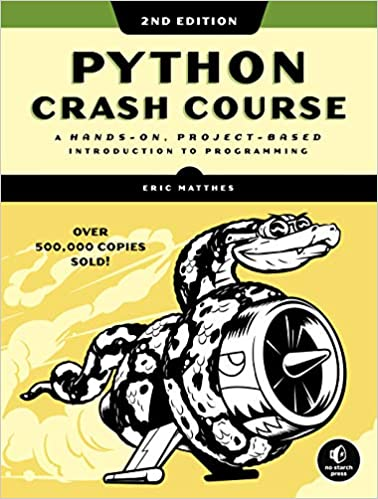

这本书有中文版。但我目测还是第一版。相较而言，国外最新版已经是第二版了。

国外亚马逊链接在[这里](https://www.amazon.com/Python-Crash-Course-2nd-Edition/dp/1593279280/ref=sr_1_1?crid=2UQKDUERI787R&dchild=1&keywords=python+crash+course&qid=1592815039&sprefix=python+crash%2Caps%2C201&sr=8-1)。

中文版京东购买点击[这里](https://union-click.jd.com/jdc?e=jdext-1258438628390801408-0&p=AyIGZRhbHQsWAVIaXxEyEgddE1kVABc3EUQDS10iXhBeGlcJDBkNXg9JHUlSSkkFSRwSB10TWRUAFxgMXgdIMhJBHGAAV1JwZQkBLUZ9agQwcwlidWILWStbHAIQD1QaWxIBIgdUGlsRBxEEUxprJQIXNwd1g6O0yqLkB4%2B%2FjcePwitaJQIWD1YSWxECFw9THVglAhoDZc31gdeauIyr%2FsOovNLYq46cqca50ytrJQEiXABPElAeEgRREl4XCxUEXBlTFAsTB1AaUgkDIgdUGlsdBRUPUBI1FGwRBlcaUxwFFwZdK1slASJZOxoLRgYTAgEcNU9RUg9UQAtBbBAPVhhTEQYQN1caWhcA)。

 

另外，在掌握了 Python 基础语法以后，对于 Python 的应用，有一本经典的书籍，近乎是必看的。我在我的公众号[《开源分享第三期》](https://mp.weixin.qq.com/s?__biz=MzU4NTIxODYwMQ==&mid=2247484912&idx=2&sn=8e2dd091697d184f6d495fcf708698f8&chksm=fd8caab6cafb23a000be6171f1a813aa3403d02d4528a42ab3f385dee93862e8bda40775b159&token=350451291&lang=zh_CN#rd)中分享过，就是这本：

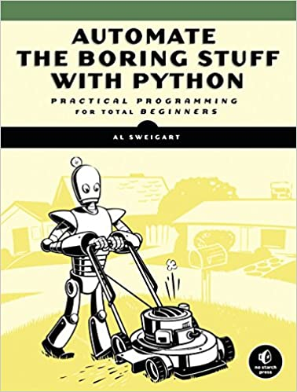

但是这本书的英文原版也已经有第二版了，国内引进的还是第一版。如果英文好的同学，可以直接看第二版。关键是，第二版的内容，官方现在可以直接在网上[免费浏览](https://automatetheboringstuff.com/2e/)！

中文版京东购买点击[这里](https://union-click.jd.com/jdc?e=jdext-1258439152880070656-0&p=AyIGZRhbHQsWAVIaXxEyEgddHlkcBhA3EUQDS10iXhBeGlcJDBkNXg9JHUlSSkkFSRwSB10eWRwGEBgMXgdIMnZCXFwmEARZZD1TPxZaZX8tUyFgWmILWStbHAIQD1QaWxIBIgdUGlsRBxEEUxprJQIXNwd1g6O0yqLkB4%2B%2FjcePwitaJQIWD1YSWxEBFAJcHV0lAhoDZc31gdeauIyr%2FsOovNLYq46cqca50ytrJQEiXABPElAeEgRREl4XChIDVhJSFAMUBlIfXAkDIgdUGlsdBRUPUBI1FGwRBlcaUxwFFwZdK1slASJZOxoIFlFGAwBPNU9RUg9XHR8TbBcHVBpYFAYQN1caWhcA)。

 

Orelly 的一本 Python 书也值得推荐：Introducing Python。我的读者在我的公众号下留言：这本书进度更快，并且覆盖decorator(装饰器)、property等python中等水平特性。

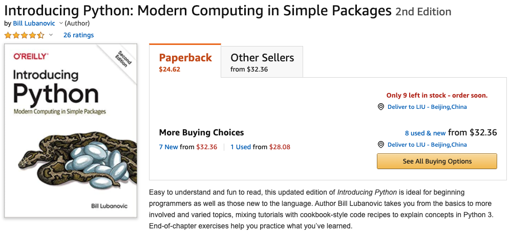

亚马逊链接在[这里](https://www.amazon.com/Introducing-Python-Modern-Computing-Packages/dp/1492051365/ref=sr_1_1?dchild=1&keywords=Introducing+Python&qid=1593034272&sr=8-1)。

中文版京东购买点击[这里](https://union-click.jd.com/jdc?e=jdext-1259372381283463168-0&p=AyIGZRhbHQsWAVIaXxEyEgdcGFsXBRc3EUQDS10iXhBeGlcJDBkNXg9JHUlSSkkFSRwSB1wYWxcFFxgMXgdIMlkdNRssb1YXZAccHGNCb2VcAQxyGGILWStbHAIQD1QaWxIBIgdUGlsRBxEEUxprJQIXNwd1g6O0yqLkB4%2B%2FjcePwitaJQIWD1caWRMEFAVTH10lAhoDZc31gdeauIyr%2FsOovNLYq46cqca50ytrJQEiXABPElAeEgRRE1kTARAOVRhSFwcVBVUcUgkDIgdUGlsdBRUPUBI1FGwRBlcaUxwFFwZdK1slASJZOxoIFQpGDwAfNU9RV04PH1tWbBcPVRJSFwYXN1caWhcA)。

 

关于 Python 语言进阶，最著名的应该就是这本了：Fluent Python

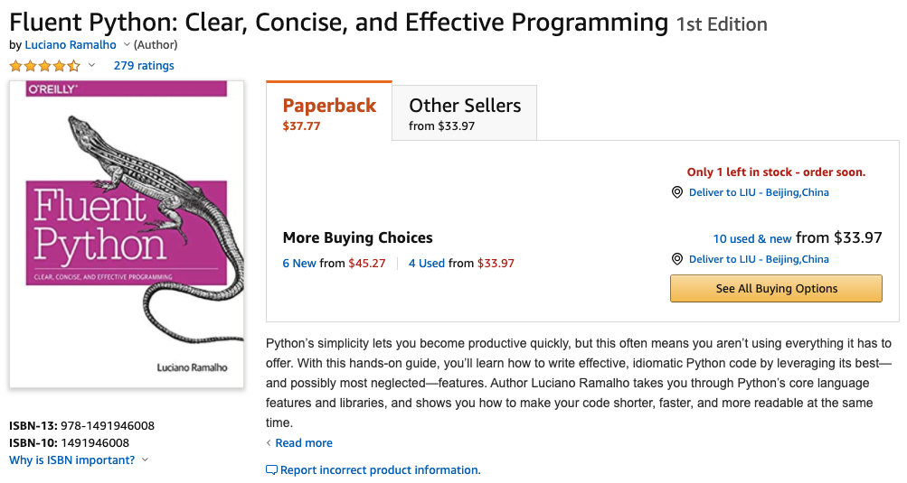

亚马逊链接在[这里](https://www.amazon.com/Fluent-Python-Concise-Effective-Programming/dp/1491946008/ref=sr_1_1?dchild=1&keywords=Fluent+Python&qid=1593034574&sr=8-1)。

中文版京东购买点击[这里](https://union-click.jd.com/jdc?e=jdext-1259372593155031040-0&p=AyIGZRhbHQsWAVIaXxEyEgRVElwVChE3EUQDS10iXhBeGlcJDBkNXg9JHUlSSkkFSRwSBFUSXBUKERgMXgdIMkBeEwEvYV5VYhRDHhF8VVhURlJgAFQLWStbHAIQD1QaWxIBIgdUGlsRBxEEUxprJQIXNwd1g6O0yqLkB4%2B%2FjcePwitaJQIWD1caWRMLEQJQHVslAhoDZc31gdeauIyr%2FsOovNLYq46cqca50ytrJQEiXABPElAeEgRRE1kTARYPVxtfEQMQB1QeWgkDIgdUGlsdBRUPUBI1FGwRBlcaUxwFFwZdK1slASJZOxoLRlUaVV0eNU9RV04IEl1CbBcBUBxYFAoaN1caWhcA)。

当然，Python 深入下去还有很多好的资源推荐。由于这篇文章重点不是 Python，所以点到为止。

 

**2. C++**

除了 Python，我还推荐学习一门编译型语言。对于这个语言的选择，于人工智能方向而言，我个人推荐 C++。因为真正的人工智能工程师，深入到底层，是需要大量使用 C/C++ 的。而 Python 更多的是一种“前端”工具，提供接口调用而已。

对于 C++ 的学习，去看 《C++ Primer》就好了。如果有 Python 基础，看这本书应该没有什么难度。当然，C++ 深入进去可以很复杂。但是在这个阶段，一本《C++ Primer》足以。

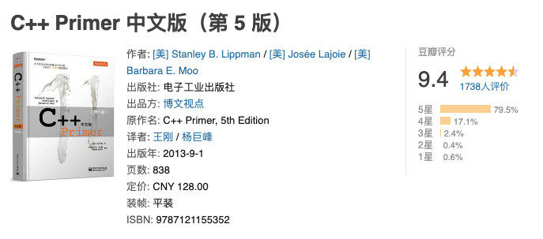

亚马逊链接在[这里](https://www.amazon.com/Primer-5th-Stanley-B-Lippman/dp/0321714113/ref=sr_1_1?dchild=1&keywords=C%2B%2B+Primer&qid=1592895269&sr=8-1)。

中文版京东购买点击[这里](https://union-click.jd.com/jdc?e=jdext-1258440104961826816-0&p=AyIGZRhbHQsWAVIaXxEyEgdXGlwVABs3EUQDS10iXhBeGlcJDBkNXg9JHUlSSkkFSRwSB1caXBUAGxgMXgdIMkpVA0ZfbwFJZSdtEFN4anMxGS4LRlQLWStbHAIQD1QaWxIBIgdUGlsRBxEEUxprJQIXNwd1g6O0yqLkB4%2B%2FjcePwitaJQIWD1YSWxEGEwdcG1IlAhoDZc31gdeauIyr%2FsOovNLYq46cqca50ytrJQEiXABPElAeEgRREl4QAxIGUBNcFQsRAFwbXAkDIgdUGlsdBRUPUBI1FGwRBlcaUxwFFwZdK1slASJZOxoIFgtHUlceNU9RUg9cGBMWbBcGXR9TFAcTN1caWhcA)。

 

如果有些同学觉得 C++ Primer 太“古董”，可以看这本 C++ Crash Course。这本书是 2019 年出的，出版社 No Starch 也名声在外。同时兼顾了 C++17 的最新特性。

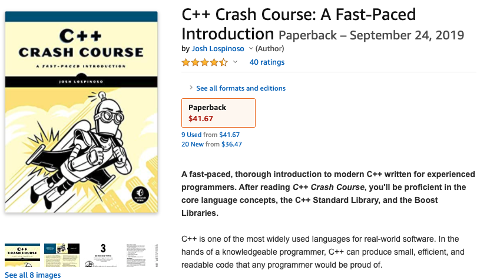

亚马逊链接在[这里](https://www.amazon.com/C-Crash-Course-Josh-Lospinoso/dp/1593278888/ref=sr_1_1?dchild=1&keywords=C%2B%2B+Crash+Course&qid=1593034061&sr=8-1)。

 

**3. 程序运行底层 & C**

下面，我要推荐一门斯坦福大学的基础课，CS107：Computer Organization & Systems。如果翻译过来的话，就是计算机的组织和系统。

这门课程听起来很深奥，但其实是一个不折不扣的基础课程。这门课程使用的语言是 C 语言。但是学习的关键完全不是 C 语言的语法知识。事实上，如果大家已经学习了 C++，掌握 C 语言的语法是很容易的。

这门课程的核心是借助 C 语言，了解计算机程序运行的一些低层级制。比如位运算；比如指针；比如内存管理；比如内存中的栈和堆之间的区别；比如类型机制乃至泛型的底层实现；包括一些底层优化等等内容。另外，这门课程也会包含一些汇编基础。

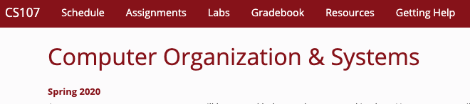

传送门：[https://web.stanford.edu/class/archive/cs/cs107/cs107.1206/index.html](https://web.stanford.edu/class/archive/cs/cs107/cs107.1206/index.html)

 

**4. 微积分**

除了语言基础，另外一个学习人工智能需要打好的基础，就是数学。

整体，人工智能需要学习的数学基础，和一般工科需要学习的数学没有什么太大的区别：微积分，线性代数和概率论。（还有一些高级的数学内容，后续会提及）

对于微积分，最流行的课本应该就是《托马斯微积分》。

中文版京东购买点击[这里](https://union-click.jd.com/jdc?e=jdext-1258440798091669504-0&p=AyIGZRNeFwsaAlMZWyUCEw5SHV0WCxcHZV8ETVxNNwxeHlRAGRlLQx5BXg1cAAQJS14MB1QSXBMEEQ5QG0RMR05aZR8Pc0dtbA1TOF5kew4iZB1qfGBCImtXGTISDlUZUxQDEgBWK1sUAxIDUBhYEwMiN1Uea1RsFwBXGlMlAyIHURNYHAIWAFIdWhwEIgddH2vDrIbS3aSCpafErfvO1qXXm6yBpd0lMiIEZUAOQUtXG1UYXxwHFwZTE1IUChIAUhNfFAcOBmUbWhQCGgBSE14cbBNpVhpZFAobAFAaUyUCIgRlRTUUUkEDVB4PHGxIVBUTCElUWWlXE1gSBBcCUStZFAMQBQ%3D%3D)。

 

另外一本经典是普林斯顿微积分读本：

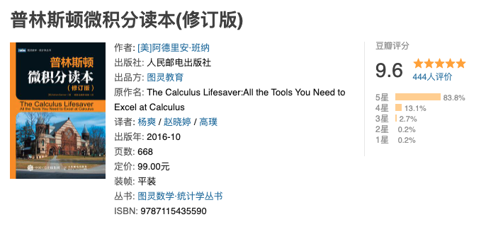

中文版京东购买点击[这里](https://union-click.jd.com/jdc?e=jdext-1258441302003757056-0&p=AyIGZRprFQETA1IeWhYyVlgNRQQlW1dCFFlQCxxKQgFHRE5XDVULR0UVARMDUh5aFh1LQglGa08GQQ8TcloXYWlbB2gsVXdXUjBfHXUOHjdVElsXChMGVRxYJQITBlUfXhYBFAZlK1sQMkRpVRpaFAMTAlEcXCUDIgdRE1gcAhYBXB1YEwYiB10fa8OshtLdpIKlp8St%2B87WpdebrIGl3SUyIgRlQA5BS1cbVRhfHAcXB1caWBQDEAFRHVoRBQ4GZRtaFAIaAFITXhxsE2lWGlkUChsAUBpTJQIiBGVFNRRSQVBdSVMVbEhUFRMPEwQaaVcTWBIBEwFTK1kUAxAF)。

 

**5. 线性代数**

对于线性代数，市面上的好教材太多。我在我的公众号文章 [学习乘法不能帮助我们理解质能方程](https://mp.weixin.qq.com/s?__biz=MzU4NTIxODYwMQ==&mid=2247485578&idx=1&sn=42d090afdf14dcbbc806722fc3ffa268&chksm=fd8ca7cccafb2edaa2cb67e0bfcea6452180a9aa7c772da242b40b75ae5d3961af44f439424e&token=2017630809&lang=zh_CN#rd) 和 [开源分享第九期](https://mp.weixin.qq.com/s?__biz=MzU4NTIxODYwMQ==&mid=2247485618&idx=2&sn=dc7fa8776bae47071592c449adc37530&chksm=fd8ca7f4cafb2ee29c48ca4347556b1309939b340505c92aafd9463ddd1b7b1ce1c714026072&scene=21#wechat_redirect) 两篇文章中总共分享了三个线性代数课本。

 

一本叫《Introduction to Linear Algebra》，最新版是第五版。

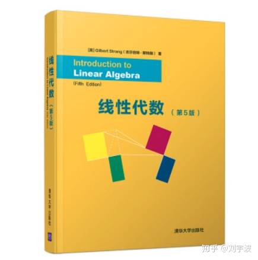

这本教材的作者是 MIT 大名鼎鼎的 Gilbert Strang。去年被炒得沸沸扬扬的清华大学把线数教材换成了英文版，用得就是这本教材；前一阵子沸沸扬扬的 86 岁老爷子还录网课，说得就是这个作者。

如果你对这两条新闻不是特别熟悉，可以搜一下。关键词：“清华把线性代数教材换成英文版”；“86岁还在录网课”。

这本书的亚马逊链接在[这里](https://www.amazon.com/Introduction-Linear-Algebra-5Th-Edn/dp/B074PY55RL/ref=sr_1_7?crid=1LCB1NE76B7QD&dchild=1&keywords=introduction+to+linear+algebra&qid=1592938855&s=books&sprefix=introduction+%2Cstripbooks-intl-ship%2C215&sr=1-7)。

京东购买点击[这里](https://union-click.jd.com/jdc?e=jdext-1258442060950409216-0&p=AyIGZRprFQEVD10bXhYyVlgNRQQlW1dCFFlQCxxKQgFHRE5XDVULR0UVARUPXRteFh1LQglGa2sFSF1SaQFMYWdDKUcedltCATRmXVMOHjdVElsXChMGVRxYJQITBlUfXhYBFAZlK1sQMkRpVRpaFAMTAlUbWyUDIgdRE1gcAhYPUhJYFgEiB10fa8OshtLdpIKlp8St%2B87WpdebrIGl3SUyIgRlQA5BS1cbVRhfHAcXBFQcWh0GEwJUE1gVBQ4GZRtaFAIaAFITXhxsE2lWGlkUChsAUBpTJQIiBGVFNRRSQQNUHg8SbEhUFRMDFkdPaVcTWBIDEAZWK1kUAxAF)。

 

Gilbert Strang 老爷子在 MIT 的线数公开课很有名，相信很多同学都看过。如果没看过的话，推荐看一下。

MIT 的官方地址在[这里](https://ocw.mit.edu/courses/mathematics/18-06-linear-algebra-spring-2010/index.htm)。

2020 年更新的视频内容在[这里](https://ocw.mit.edu/resources/res-18-010-a-2020-vision-of-linear-algebra-spring-2020/videos/)。

 

另一本叫《Linear Algebra and Its Applications》，最新版是第五版。有中文版，叫《线性代数及其应用》。听名字，这本书似乎更强调应用，但其实 Gilbert 老爷子的书也有专门一章讲应用。

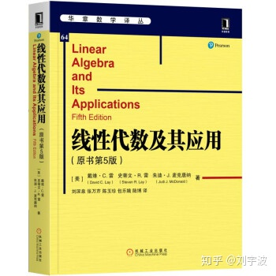

这本书的亚马逊链接在[这里](https://www.amazon.com/Linear-Algebra-Its-Applications-5th/dp/032198238X/ref=sr_1_1?dchild=1&keywords=Linear+Algebra+and+Its+Applications&qid=1592895867&sr=8-1)。

京东购买点击[这里](https://union-click.jd.com/jdc?e=jdext-1258442438882521088-0&p=AyIGZRtSEQoUBFUbXRIyEABXHV4TBBQFUBtrUV1KWQorAlBHU0VeBUVNR0ZbSkAOClBMW0sZXBcEFwFTHVkQAg1eEEcGJXhIHS5ACXAEck8JGDhiHBNXEFg6T2IeC2UbUhUAGgZUG1wWMhIGVBtfEAERAVQraxUHIkY7HlsUCxA3VCtbEQoRDlUcWhELFwZQK1sdBiLR%2B4%2BOnb3Lt%2FDN8bvXn7eAkvDBvJQ3ZStYJVlHUxxeRxUBFg5QHlgQABsOXBhfFgITDlwHWiUCEwZVE1wSChcOOxo1FgMQBl0SXBADGjdVK1glXHwGBhgIRwVBDjtBCFUKSAYBWTUQAxoOXBJaEDIQBlQZWQ%3D%3D)。

 

最后一本，是我的一个同学，现在在硅谷 Google 总部工作的大神推荐的。据说非常非常适合入门，叫《Linear Algebra Done Right》。

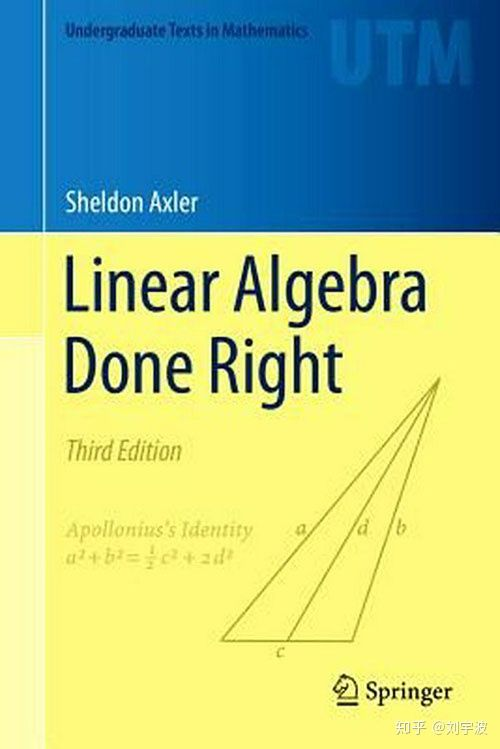

可惜这本书并没有中文版。不过现在疫情期间，Springer 很多书籍都免费下载，包括这本书。对此感兴趣的同学不要错过。官网链接在[这里](https://link.springer.com/book/10.1007/978-3-319-11080-6)。

因为可以免费下载，所以我直接把这本书的 PDF 放在这个代码仓下了。大家可以在这里直接[下载](downloads/2015_Book_LinearAlgebraDoneRight.pdf)。

 

**6. 概率论（和数理统计）**

对于概率论，我推荐斯坦福的 CS109：Probability for Computer Scientists。

这门课程翻译过来就叫《为计算机科学家准备的概率论》，所以对于计算机专业来说，学起来更有针对性。

另外，学习这门课程的过程中，也就会接触一些机器学习方面的基本概念了

传送门：[http://web.stanford.edu/class/cs109/](http://web.stanford.edu/class/cs109/)

 

#### 第二年：计算机基础

如果想成为一名人工智能工程师，计算机领域的基础必须打好。但与此同时，我认为专注于人工智能方向，一些特别低层的内容，比如组成原理，或者数字逻辑，甚至是编译原理等等，并不需要专门学习。所以下面的推荐，并不包含这些内容。

下面是我认为人工智能方向应该重视的计算机基础知识，应该在第二年掌握。

 

**1. 算法和数据结构**

算法和数据结构的重要性不想多说了。就算你不理解他们实际上有什么用，只要明白，想当工程师，面试必考算法和数据结构就好了。

当然，如果你认真学习这篇文章推荐的后续课程内容，近乎一定会体会到算法和数据结构的巨大意义。

关于资源，推荐两个，都是书籍。

首先，就是大名鼎鼎的《算法4》。

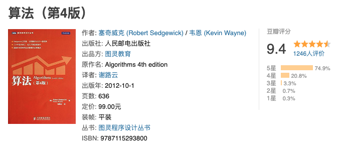

亚马逊链接在[这里](https://www.amazon.com/Algorithms-4th-Robert-Sedgewick/dp/032157351X/ref=sr_1_1?dchild=1&keywords=algorithm&qid=1592939552&sr=8-1)。

中文版京东购买点击[这里](https://union-click.jd.com/jdc?e=jdext-1258443669071400960-0&p=AyIGZRhbHQsWAVIaXxEyEgdUE1ITCxo3EUQDS10iXhBeGlcJDBkNXg9JHUlSSkkFSRwSB1QTUhMLGhgMXgdIMkxTBUEtfHlvZDYYB1ZYTV1RRSN3Y0QLWStbHAIQD1QaWxIBIgdUGlsRBxEEUxprJQIXNwd1g6O0yqLkB4%2B%2FjcePwitaJQIWD1YSWxIAFgdRG1klAhoDZc31gdeauIyr%2FsOovNLYq46cqca50ytrJQEiXABPElAeEgRREl4QABUAXRpdFQcTBl0cWgkDIgdUGlsdBRUPUBI1FGwRBlcaUxwFFwZdK1slASJZOxoIFQoVUgYfNU9RUg8VSwBSbBcGXR1TFgAUN1caWhcA)。

 

《算法4》其实也有不少缺点，找时间我专门写文章聊一聊。但是在这篇文章，大家可以注意两点。

第一点，《算法4》的代码是基于 Java 语言的。所以，大家可以再借此接触一下 Java 语言，没坏处的。而且如果大家已经有了 C++ 基础，上手 Java 是很快的。

第二点，就是《算法4》偏经典的算法和数据结构的底层实现，而在算法设计方面介绍得很少。所以，就有了我推荐的第二个资源：《算法设计手册》。

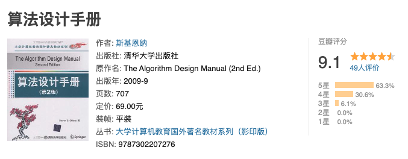

这本书更偏向算法设计，我认为和《算法4》能形成一个很好的互补。

我一查才知道，这本书似乎国内没有引进中文版？但依然是，由于疫情原因，这本书的英文原版正版现在在国外是免费下载的。传送门：

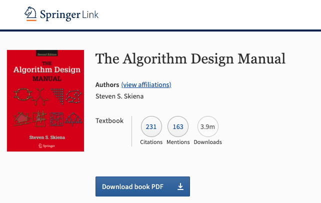

传送门：[https://link.springer.com/book/10.1007/978-1-84800-070-4](https://link.springer.com/book/10.1007/978-1-84800-070-4)

因为可以免费下载，所以我直接把这本书的 PDF 放在这个代码仓下了。大家可以在这里直接[下载](downloads/2008_Book_TheAlgorithmDesignManual.pdf)。

 

**2. 操作系统基础**

操作系统也属于计算机专业的必修课程。这不仅仅是因为我们需要了解操作系统的很多底层机制，更重要的是，我们可以借此学习很多系统设计（System Design）方面的理念。

要知道，一个人工智能应用，也是一个系统。在系统设计开发层面，很多东西是共通的。

操作系统方面也有很多经典教材。如果推荐书的话，我推荐这本《Operating Systems: Three Easy Pieces》

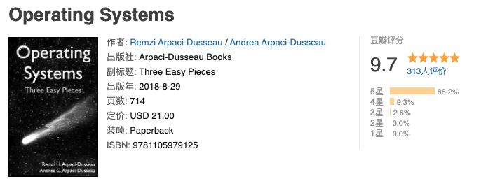

不过这本书貌似也没有引进中文版。但是英文版是可以免费在线浏览的。传送门：[http://pages.cs.wisc.edu/~remzi/OSTEP/](http://pages.cs.wisc.edu/~remzi/OSTEP/)

关于视频课程，我推荐斯坦福的课程 CS140：Operating Systems。

传送门：[http://web.stanford.edu/~ouster/cgi-bin/cs140-spring20/index.php](http://web.stanford.edu/~ouster/cgi-bin/cs140-spring20/index.php)

 

关于操作系统，进一步引申至计算机原理层面，比如组成原理等相关内容，虽然上面我说，个人认为专门学习人工智能并不需要专门掌握，但是如果感兴趣的同学，还是有一门很经典的书推荐一读的，就是大名鼎鼎的 CSAPP：Computer Systems: A Programmer's Perspective

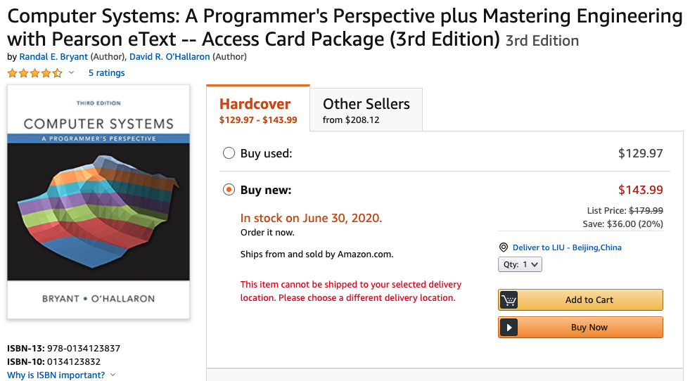

亚马逊链接在[这里](https://www.amazon.com/Computer-Systems-Programmers-Perspective-Engineering/dp/0134123832/ref=sr_1_1?crid=2QWJ6MII3OH8A&dchild=1&keywords=computer+systems+a+programmer%27s+perspective%2C+third+edition&qid=1593034803&sprefix=Computer+Sys%2Caps%2C279&sr=8-1)。

中文版京东购买点击[这里](https://union-click.jd.com/jdc?e=jdext-1259365663120216064-0&p=AyIGZRprFQETBlIcWRMyVlgNRQQlW1dCFFlQCxxKQgFHRE5XDVULR0UVARMGUhxZEx1LQglGa2gKelgyARtzYWQEDEkFC3VVVFN6HkMOHjdVElsXChMGVRxYJQITBlUfXhYBFAZlK1sQMkRpVRpaFAMTAlQfWCUDIgdRE1kUABUHUxhYEQciB10fa8OshtLdpIKlp8St%2B87WpdebrIGl3SUyIgRlQA5BS1cbVRhfHQAVA1IcWRUBEwRVHFoSBw4GZRtaFAIaAFITXhxsE2lWGlkUChsAUBpTJQIiBGVFNRRREgVXElMUbEhUEF0GUFFTaVATWxYEEQdRK1kUAxAF)。

 

**3. 数据库基础**

做人工智能需要处理大量的数据，这就需要使用数据库，了解数据库的基础。同时，这本质也是在学习“数据模型”这个概念，了解数据存储的设计方案。

数据库方面的经典教材也很多。如果只是简单学习 SQL 语言的话，我认为《SQL必知必会》最实用。我曾经推荐这本书给某个同学，这名同学两周的时间，不但刷完了这本书，还把 Leetcode 上所有数据库相关的问题都给做了。

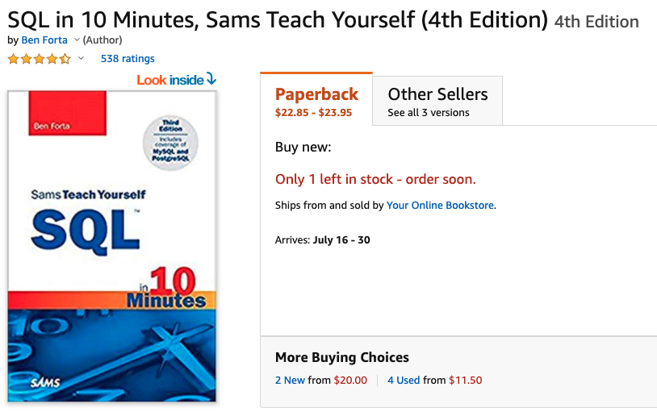

亚马逊链接在[这里](https://www.amazon.com/SQL-Minutes-Sams-Teach-Yourself/dp/0672336073/ref=sr_1_2?dchild=1&keywords=SQL&qid=1592936262&sr=8-2)。

中文版京东购买点击[这里](https://union-click.jd.com/jdc?e=jdext-1258445587717947392-0&p=AyIGZRhbHQsWAVIaXxEyEgdWGVgSChs3EUQDS10iXhBeGlcJDBkNXg9JHUlSSkkFSRwSB1YZWBIKGxgMXgdIMmVmT2clVWpuZDJDPXJ7bmQ0UC0UYUQLWStbHAIQD1QaWxIBIgdUGlsRBxEEUxprJQIXNwd1g6O0yqLkB4%2B%2FjcePwitaJQIWD1YSWxILEw5dE1glAhoDZc31gdeauIyr%2FsOovNLYq46cqca50ytrJQEiXABPElAeEgRREl4QBhYOUx1bEwoXAVcTWAkDIgdUGlsdBRUPUBI1FGwRBlcaUxwFFwZdK1slASJZOxoLRlUXU1JONU9RUldUGQBWbBAPVhNYFgcSN1caWhcA)。

 

另外，有两个在线学习 SQL 的网站，挺有名的。有兴趣的同学可以尝试。

一个叫 [SQLZoo](https://sqlzoo.net/)。

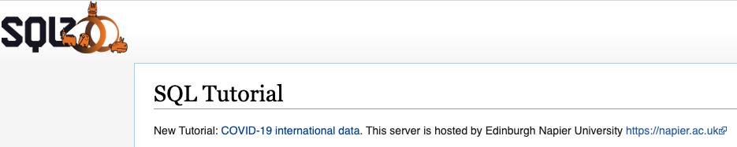

另一个叫 [SQLBolt](https://sqlbolt.com/):

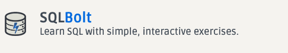

 

当然了，关于数据库，如果追求的并不仅仅是使用 SQL 的话，我推荐学习斯坦福大学的课程 CS145：Data Management and Data Systems。

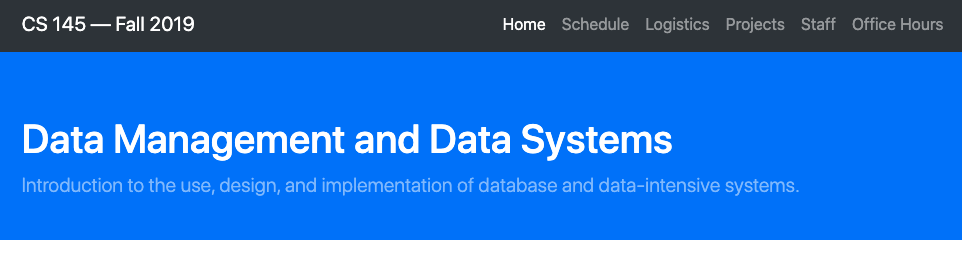

传送门：[https://cs145-fa19.github.io/](https://cs145-fa19.github.io/)

 

**4. 并行计算基础**

我上学的年代，并行计算还不是计算机专业必学的内容。但现在，并行计算已经无处不在了。时代发展太快了，计算机专业的同学已经必学并行计算了。

关于并行计算，分布式系统相关的入门书籍，有一本非常著名。也有中文版，叫《数据密集型应用系统设计》

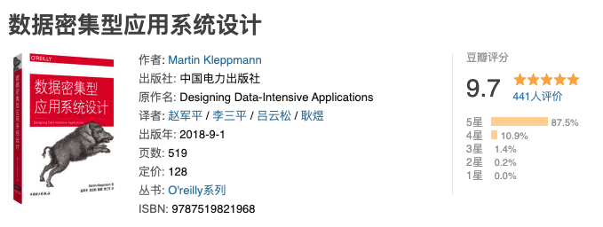

亚马逊链接在[这里](https://www.amazon.com/Designing-Data-Intensive-Applications-Reliable-Maintainable/dp/1449373321)。

中文版京东购买点击[这里](https://union-click.jd.com/jdc?e=jdext-1258448210928152576-0&p=AyIGZRprFQEXBVMcWBAyVlgNRQQlW1dCFFlQCxxKQgFHRE5XDVULR0UVARcFUxxYEB1LQglGa2taVEwJbDprYElhLGYPflxmD1wSL1MOHjdVElsXChMGVRxYJQITBlUfXhYBFAZlK1sQMkRpVRpaFAMTA1EeUyUDIgdRE1gcAhQCVx5eEAEiB10fa8OshtLdpIKlp8St%2B87WpdebrIGl3SUyIgRlQA5BS1cbVRhfHAcXDlYbWh0BGwdRGF8TBQ4GZRtaFAIaAFITXhxsE2lWGlkUChsAUBpTJQIiBGVFNRRSQVBQEloQbEhUFUsOTQZGaVcTWRUEGgNRK1kUAxAF)。

 

如果对课程资料感兴趣，我推荐斯坦福大学的课程 CS149：PARALLEL COMPUTING

传送门：[http://cs149.stanford.edu/fall19/](http://cs149.stanford.edu/fall19/)

 

**5. 人工智能基础**

作为一个人工智能专业的学习路径，终于出现人工智能啦！

在这里，我首先推荐大家整体性地了解人工智能这个领域。

什么叫整体地了解？因为现在说到人工智能，很多同学就会直接想到机器学习或者深度学习。但其实，机器学习和深度学习只是人工智能的一个子领域而已。

与此同时，有很多同学都问过我，想了解诸如 A* 算法，遗传算法，模拟退火，蚁群算法等等这类的算法，应该看什么？其实，这类算法都是人工智能算法，只不过在现阶段，相比机器学习的算法，这些算法的成绩不够“耀眼”。

但是，如果深入了解人工智能，我认为这些算法也是需要学习的。要知道，神经网络其实在十几年前，也是人工智能领域不够“耀眼”的思想之一，静静地躺在角落里，直到最近有了巨大的突破，风靡于世。谁知道再过十年，哪种思想会突然有所突破，爆发起来呢？

关于整体性地了解人工智能，最经典的教材，就是这本了：

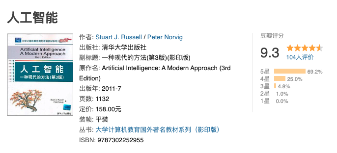

亚马逊链接在[这里](https://www.amazon.com/Artificial-Intelligence-Approach-Stuart-Russell/dp/9332543518/ref=sr_1_2?crid=DUVUAHSCTLKO&dchild=1&keywords=artificial+intelligence+a+modern+approach&qid=1592936849&s=books&sprefix=artificial+intelligence+a+%2Cstripbooks-intl-ship%2C201&sr=1-2)。

中文版京东购买点击[这里](https://union-click.jd.com/jdc?e=jdext-1258448640840314880-0&p=AyIGZRhbHAYSAlQSXRUyFAZTElkcAhcGUx5rUV1KWQorAlBHU0VeBUVNR0ZbSkAOClBMW0sdWhMLEA5VHloTBw1eEEcGJWVQXwluHmN1chlWeDBFcFVzHhkkUlQeC2UbUhUAGgZUG1wWMhIGVBtfEAERAVQraxUHIkY7G1oXBBAEUhprFDISA10YUhUEFgVSE1gWMhIPUSuNu5bHj%2BrC67DUuKmAluvAi7nT651rJTIRNw5OD1xHDgdWH1IQBxsAUBpSEAMQB1ASUhQeEzdVGloVChUAXR5SewN8BFQZWh0LFQJUE2sVMhE3C3VaRVJFBAFPUntYQUcFTBocAnwFXRlYFwUUB2UZWhQAEA%3D%3D)。

 

但是，这本书是一个大部头，细细啃一遍太花时间了。我建议配合一个视频课程看。比如，斯坦福大学的 CS221: Artificial Intelligence: Principles and Techniques

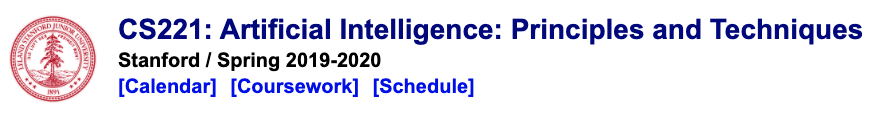

传送门：[https://stanford-cs221.github.io/spring2020/](https://stanford-cs221.github.io/spring2020/)

或者，EdX 上有一门课程，我学过，是以这本书为纲的，我觉得挺不错的。可以免费试听。

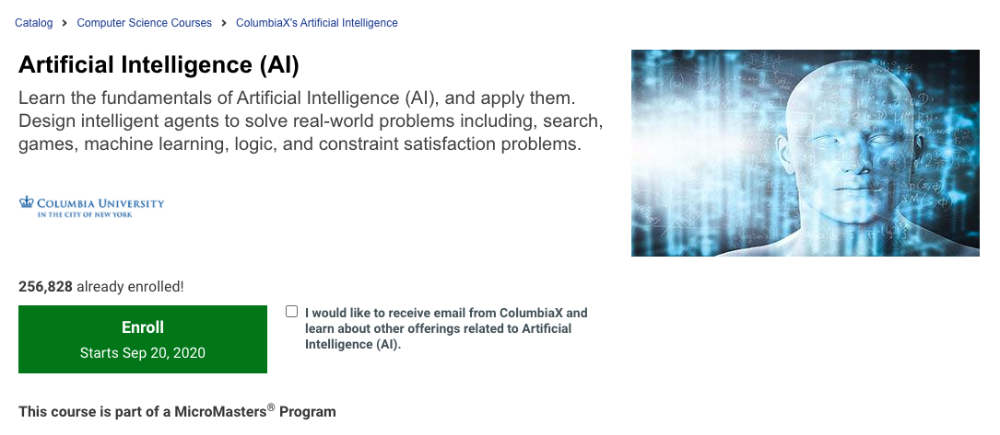

传送门：[https://www.edx.org/course/artificial-intelligence-ai](https://www.edx.org/course/artificial-intelligence-ai)

 

#### 第三年：机器学习

现在，是时候深入学习当下人工智能领域最主流的方法：机器学习和深度学习了。

 

**1. 机器学习 + 深度学习**

机器学习领域最著名的课程，就是斯坦福大学的 CS229 了。Andrew Ng 在 Coursera 上大名鼎鼎的《机器学习》课程，就是这门 CS 229 的简化。

斯坦福大学的 CS 229，比 Coursera 上的课程更加深入，内容也更丰富。不过现在，已经不是 Andrew Ng 讲了。

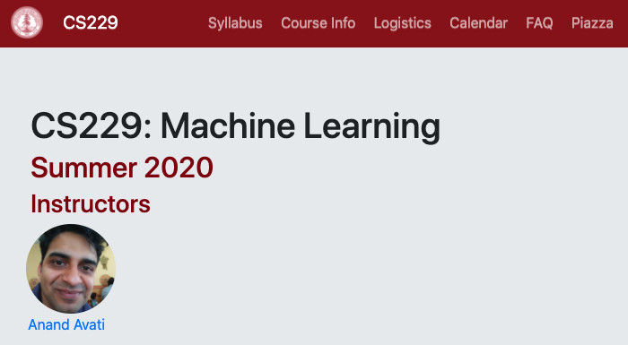

传送门：[http://cs229.stanford.edu/](http://cs229.stanford.edu/)

 

当然，说到了 Andrew Ng，就要说说他在 Coursera 上的一系列课程，在这个阶段都可以看一看。

最著名的当属 Machine Learning。这名课程的 logo 使用的这个小机器人，都快成机器学习领域的吉祥物了。

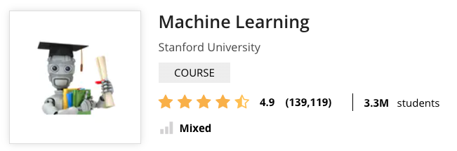

传送门：[https://www.coursera.org/learn/machine-learning?](https://www.coursera.org/learn/machine-learning?)

 

Andrew Ng 后来创办了 deeplearning.ai 后，在 Coursera 上开设了一个深度学习的系列课程，也值得学习。 （虽然使用的 tf 版本有点儿老。）

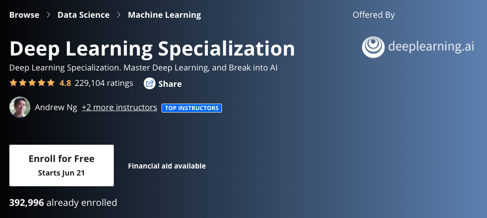

传送门：[https://www.coursera.org/specializations/deep-learning](https://www.coursera.org/specializations/deep-learning)

 

对于书籍，我推荐 Hands-On Machine Learning with Scikit-Learn, Keras, and TensorFlow: Concepts, Tools, and Techniques to Build Intelligent Systems。

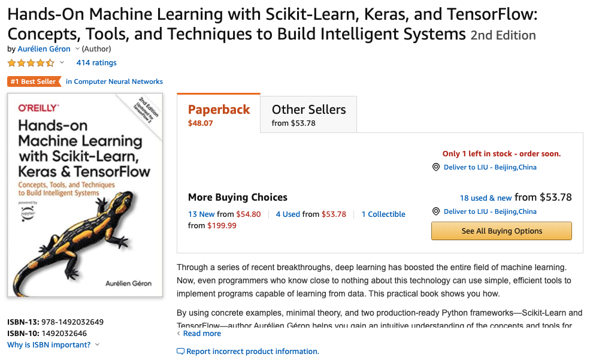

亚马逊链接在[这里](https://www.amazon.com/Hands-Machine-Learning-Scikit-Learn-TensorFlow/dp/1492032646/ref=sr_1_1?crid=2LAYAPBMAIC92&dchild=1&keywords=machine+learning&qid=1592817718&sprefix=machine+%2Caps%2C201&sr=8-1)。

中文版京东购买点击[这里](https://union-click.jd.com/jdc?e=jdext-1258449965666004992-0&p=AyIGZRhbHQsWAVIaXxEyEgRQGFMXAxU3EUQDS10iXhBeGlcJDBkNXg9JHUlSSkkFSRwSBFAYUxcDFRgMXgdIMlUFLH8yFkEWZAxtA1BrQVk0SClyf1QLWStbHAIQD1QaWxIBIgdUGlsRBxEEUxprJQIXNwd1g6O0yqLkB4%2B%2FjcePwitaJQIWD1YSWxMLFgRcGlwlAhoDZc31gdeauIyr%2FsOovNLYq46cqca50ytrJQEiXABPElAeEgRREl4QChoAURxcEgMTAl0TWAkDIgdUGlsdBRUPUBI1FGwRBlcaUxwFFwZdK1slASJZOxoLRlUXU1UbNU9RUlcJTRAWbBAPVx5cEAAXN1caWhcA)。

这本书国内有引进，但是国内引进的是第一版，现在国外最新版本已经是第二版了。

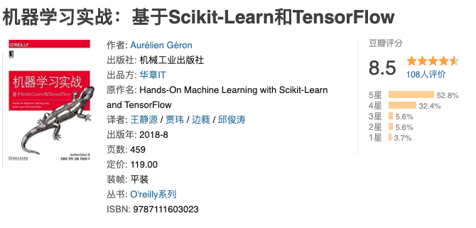

 

不过这本书偏实战。如果对偏理论感兴趣的同学，当然就推荐西瓜书啦。

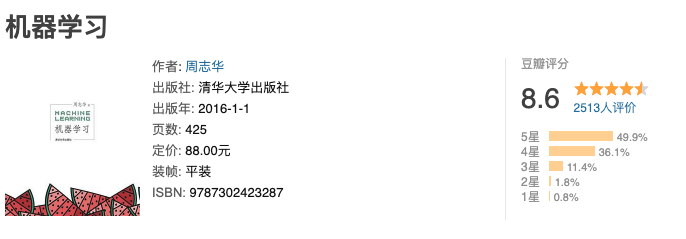

京东购买链接点击[这里](https://union-click.jd.com/jdc?e=jdext-1258450274130993152-0&p=AyIGZRprFQIbAFMSWhcyVlgNRQQlW1dCFFlQCxxKQgFHRE5XDVULR0UVAhsAUxJaFx1LQglGaxcAEHw9YRxSYHAECRstVncQTFZZLHUOHjdVElsXChMGVRxYJQITBlUfXhYBFAZlK1sQMkRpVRpaFAMTAlUbWyUDIgdRE1gcAhQPVhxZHAciB10fa8OshtLdpIKlp8St%2B87WpdebrIGl3SUyIgRlQA5BS1cbVRhfHAcWBlYdXhUAEw9dGVsRAQ4GZRtaFAIaAFITXhxsE2lWGlkUChsAUBpTJQIiBGVFNRRREVQCH1IcbEhUFUsFFUEVaVAbWxQGEQVTK1kUAxAF)。

最近，周志华老师还出了一本书，叫《机器学习理论导引》，豆瓣评分也颇高，相信也不错。

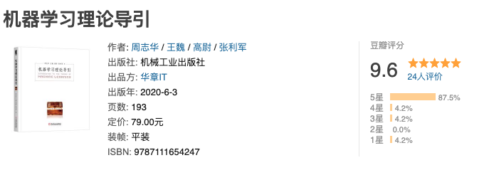

京东购买链接点击[这里](https://union-click.jd.com/jdc?e=jdext-1259366031560634368-0&p=AyIGZRprFQEbAVUfXhAyVlgNRQQlW1dCFFlQCxxKQgFHRE5XDVULR0UVARsBVR9eEB1LQglGaxJcVFwKXV5SYVdhI2EndHQIf11DJXUOHjdVElsXChMGVRxYJQITBlUfXhYBFAZlK1sQMkRpVRpaFAMTAlQfWCUDIgdRE1kUABUEURNTFQAiB10fa8OshtLdpIKlp8St%2B87WpdebrIGl3SUyIgRlQA5BS1cbVRhfHQAVAFQZWxEFEwBXHlkSCw4GZRtaFAIaAFITXhxsE2lWGlkUChsAUBpTJQIiBGVFNRRSQVBQT11AbEhUEF0ES0pSaVAdXhUKEAVVK1kUAxAF)。

 

**2. 数据科学基础**

其实，数据科学和基础的机器学习算法的应用有很多重合的地方。在这里，想强调一点，对于使用 Python 做机器学习，有一些基础的库需要大家熟练了解，主要就是 numpy，pandas，包括大家如果做可视化的话，需要使用 matplotlib。对于这些内容的学习，推荐一本书：Python for Data Analysis

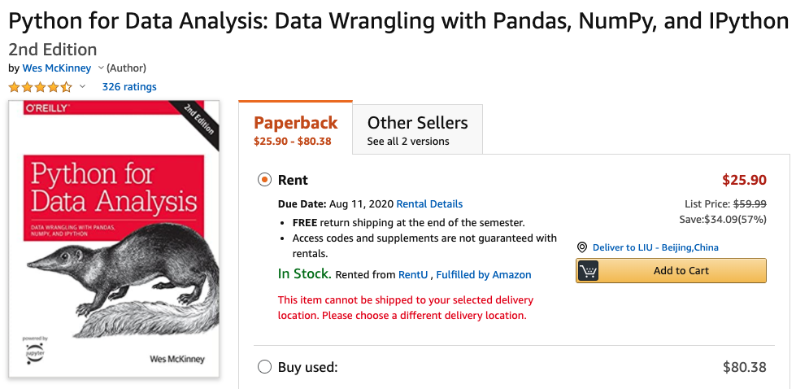

亚马逊链接在[这里](https://www.amazon.com/gp/product/1491957662?pf_rd_r=XYPYN20F0D4Q5TZ0BQK6&pf_rd_p=6fc81c8c-2a38-41c6-a68a-f78c79e7253f)。

中文版京东购买点击[这里](https://union-click.jd.com/jdc?e=jdext-1259366401271730176-0&p=AyIGZRhbHQsWAVIaXxEyEgRXE1ITARY3EUQDS10iXhBeGlcJDBkNXg9JHUlSSkkFSRwSBFcTUhMBFhgMXgdIMhNZPBM%2FTkttZwVhHBNcawQ8bytUZlQLWStbHAIQD1QaWxIBIgdUGlsRBxEEUxprJQIXNwd1g6O0yqLkB4%2B%2FjcePwitaJQIWD1caWRIAFw5UG1MlAhoDZc31gdeauIyr%2FsOovNLYq46cqca50ytrJQEiXABPElAeEgRRE1kSBRcGVRhdFQQQBlUdXAkDIgdUGlsdBRUPUBI1FGwRBlcaUxwFFwZdK1slASJZOxoLRlVBU1VPNU9RV0EUQRJVbBcBUBhcEwESN1caWhcA)。

 

**3. 凸优化**

学习了机器学习，大家就会知道，大多数机器学习方法都是要求解一个最优函数。其中就需要的一个相对比较专门的数学基础：凸优化。

关于凸优化，斯坦福大学的 CS364a 是这方面的入门课程。另外，课程中也推荐了一本教材。

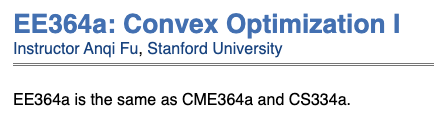

传送门：[http://web.stanford.edu/class/ee364a/](http://web.stanford.edu/class/ee364a/)

 

**4. 概率图模型**

概率图模型也是深入理解很多人工智能方法的利器，在图像识别，自然语言处理领域都有非常多的应用。我研究生时期的毕业课题，是做虚拟动作识别，也需要使用概率图模型。

关于概率图模型，斯坦福大学有一门非常经典的课程 CS 228: Probabilistic Graphical Models

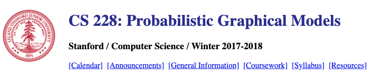

传送门：[https://cs.stanford.edu/~ermon/cs228/index.html](https://cs.stanford.edu/~ermon/cs228/index.html)

在 Coursera 上也有一个概率图模型的系列课程，是斯坦福的这门课程的简化版本。

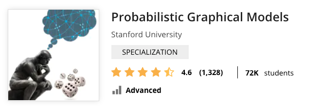

传送门：[https://www.coursera.org/specializations/probabilistic-graphical-models](https://www.coursera.org/specializations/probabilistic-graphical-models)

 

**5. 数据挖掘**

数据挖掘主要是对大规模数据进行处理的。在数据的聚类分析，大规模的监督学习，包括推荐系统等领域，都有广泛应用。

对于数据挖掘，推荐斯坦福大学的 CS246: Mining Massive Data Sets。

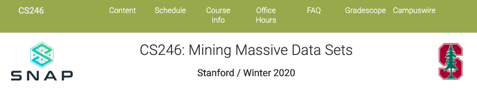

传送门：[http://web.stanford.edu/class/cs246/](http://web.stanford.edu/class/cs246/)

 

#### 第四年：专有领域学习

机器学习方法是领域相关的。在不同的领域，有很多专有的方法，包括专门的研究对象，需要进一步学习。

学到这里，相信大家已经有了相当的基础，可以挑选自己喜欢的方向，去做专门的学习了。

 

**1. 卷积神经网络和计算机视觉**

计算机视觉近乎是现在人工智能被应用最广泛的领域了，从人脸识别到 OCR，从无人驾驶到各种工业机器人的智能系统。

对于人工智能在视觉领域的应用，最著名的课程，应该就是华人科学家李飞飞在斯坦福大学的课程了。CS231n Convolutional Neural Networks for Visual Recognition。

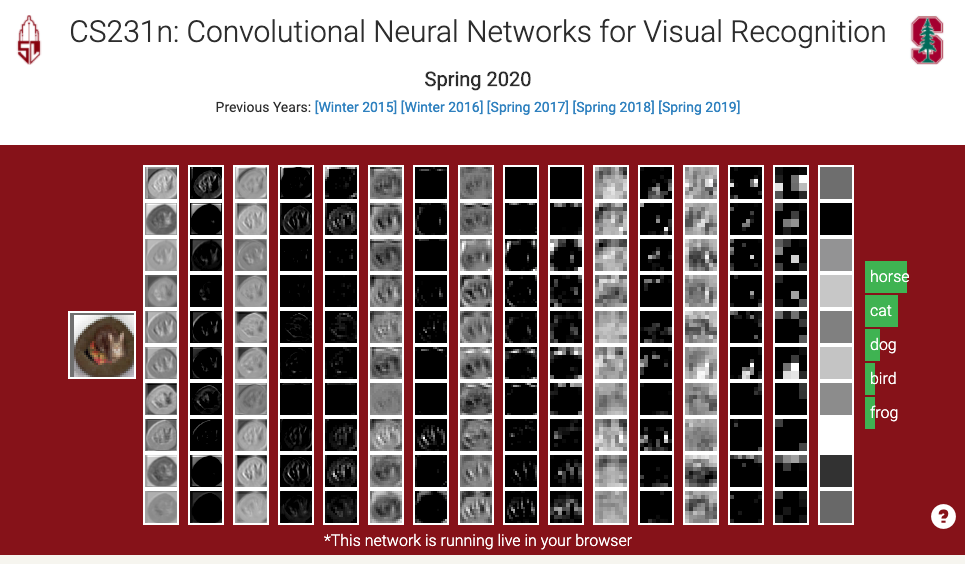

传送门：[http://cs231n.stanford.edu/](http://cs231n.stanford.edu/)

 

**2. 自然语言处理**

当下人工智能另外一个应用非常广泛的应用领域，就是自然语言处理了。

这方面的经典课程，我推荐斯坦福大学的 CS224n: Natural Language Processing with Deep Learning。

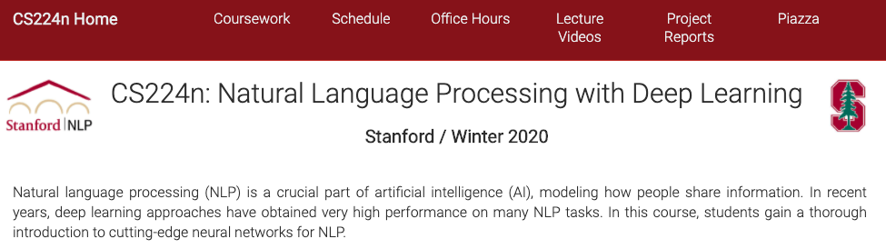

传送门：[http://web.stanford.edu/class/cs224n/](http://web.stanford.edu/class/cs224n/)

 

最近，Andrew Ng 的 deeplearning.ai 在 Coursera 上新开设了一个系列课程，叫 Natural Language Processing Specialization，有兴趣的同学也可以参考。

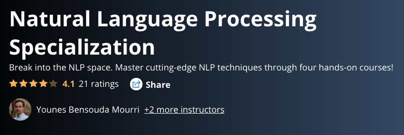

传送门：[https://www.coursera.org/specializations/natural-language-processing](https://www.coursera.org/specializations/natural-language-processing)

 

**3. 机器学习在金融领域的应用**

人工智能在金融领域的应用也是一个重要的趋势。但是通常，在计算机专业中，不是被特别强调。毕竟大多数计算机专业的学生还是要去 IT 大厂，而不是华尔街。

但是因为有很多同学对人工智能在金融领域的应用感兴趣，在这里也提一句。我在我的[《开源分享第一期》](https://mp.weixin.qq.com/s?__biz=MzU4NTIxODYwMQ==&mid=2247484784&idx=1&sn=990039bc5d1c38ed097ad6e04407669f&chksm=fd8caa36cafb232094d4cf75b049a8fa5816b9db916b2bd63123a6802d409cbf2a64a46abf43&scene=21#wechat_redirect)，就分享了一本书，是公认的机器学习在金融领域应用的宝典。感兴趣的同学可以参考：

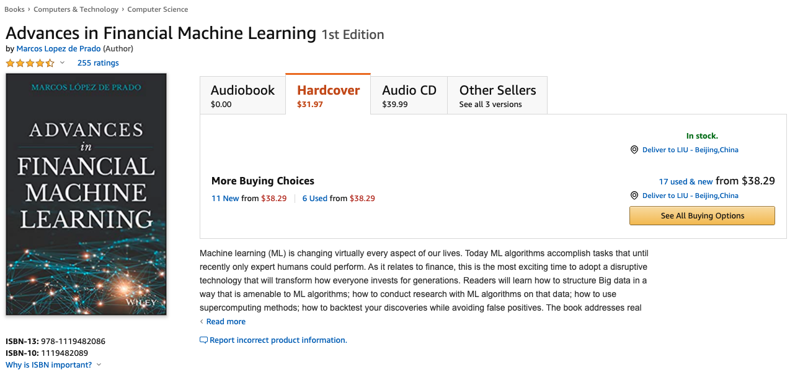

亚马逊链接在[这里](https://www.amazon.com/Advances-Financial-Machine-Learning-Marcos/dp/1119482089/ref=sr_1_1?crid=1GIKRQZD7A1QA&dchild=1&keywords=advanced+financial+machine+learning&qid=1592937952&s=books&sprefix=advanced+fin%2Cstripbooks-intl-ship%2C210&sr=1-1)。

 

**4. 机器学习在生物医学医药领域的应用**

同样，机器学习在医学医药领域也有了越来越多的应用。只不过通常计算机专业的同学不很了解这方面。而是相反的，很多医学医药领域的人，会来学习人工智能的知识，进而应用在自己的领域，这种情况更多一些。

关于生物医学医药领域，整体我还是很看好的。虽然不知道爆炸的时间是什么时候，但我相信有着光明的未来。

而且，这个领域和计算机专业有着越来越多的交集，我之前在公众号还写过一篇文章：[《算法不好的工程师不是优秀的生物学家》](https://mp.weixin.qq.com/s?__biz=MzU4NTIxODYwMQ==&mid=2247485503&idx=1&sn=03b9c026598f4c2c548480e5eed7a5a1&chksm=fd8ca779cafb2e6fe7a9f1c08258c9fe6aa6845e7270904f44c6324ec3ba10425e4b9f893fb1&scene=21#wechat_redirect)。

在这方面，Andrew Ng 的 deeplearning.ai 在 Coursera 上也开设了一个系列课程，叫 Ai for Medicine，感兴趣的同学可以去了解一下。

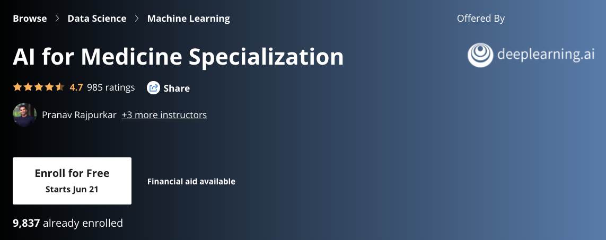

传送门：[https://www.coursera.org/specializations/ai-for-medicine](https://www.coursera.org/specializations/ai-for-medicine)

 

**5. Kaggle**

当然了，学习到这里，大家已经可以（其实早就可以了）去参加 Kaggle 的竞赛了。在 Kaggle 上，会有大量真实的数据供大家实验，让大家尝试解决“真实的问题”。虽然在这类平台上竞技，其实和解决真实的问题还是有差距，但也比使用虚拟的数据，或者仅仅是学习原理，强太多。

同时，Kaggle 也绝不仅仅只是一个竞赛平台，更是一个非常好的学习平台，或者说是机器学习相关的垂直交流平台。Kaggle 上大部分任务都有相当多的公开的 notebook，供大家交流学习。仔细研究的话，相信每个人都能从中受到很多启发。

当然了，如果此时，大家有机会，能到真正的业界去参与真实的项目，那就更赞了。

 

如果你真的想认真学习人工智能，相信这篇文章，为你提供了一个很好的路线。

所有的资源都在这里了，就差投入时间精力好好学习了：）

**大家加油！**

 

---

如果大家还有好的资源补充，欢迎大家来给我提 issue 哇！：）